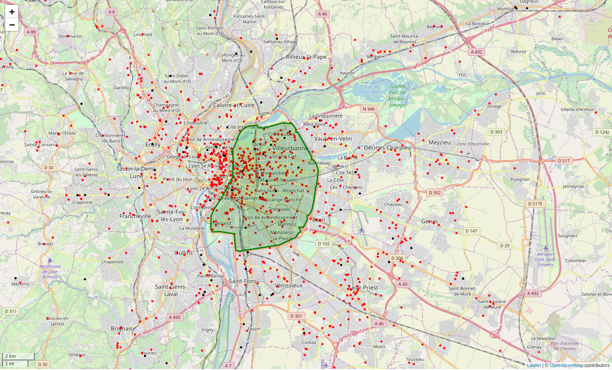

# SmartGovLezModelUFD

A Low Emission Zones model implementation for the
[SmartGovSimulator](https://github.com/smartgov-liris/SmartGovSimulator).

# Documentation
The project is documented in detail [here](documentation/Home.md).

The complete Javadoc is also [available online](https://smartgov-liris.github.io/SmartGovLezModelUFD/).

# Introduction

A Low Emission Zone (LEZ) is a special urban area where more polluting vehicles are
not allowed to enter.

Perimeters and permissions of such zones is very variable in the European
Union, so this project from the [LIRIS](https://liris.cnrs.fr/en) is an attempt
to evaluate the impact of such zones on pollutant emissions, in the context of
the Urban Goods Transport.

# Features

The following features have been implemented :
- Fleet generation from an input establishment set
- Determination of establishments concerned by the LEZ given 
  a LEZ perimeter / permissions
- Vehicle replacements depending on the LEZ 
- Rounds simulation over a day, and pollutant emissions computation with /
	without the input LEZ, using the [COPERT
	model](https://www.emisia.com/utilities/copert/).
- Pollution tile map generation from the output

The final model is provided as a Command Line Interface wrapped in a [single
.jar
file](https://github.com/smartgov-liris/SmartGovLezModelUFD/blob/master/SmartGovLez-MASTER.jar),
and takes various input and output parameters. See the
[documentation](documentation/Home.md) for detailed usage instructions.

# Build from source

From the repository where you want to install the source code, run:

`git clone https://github.com/smartgov-liris/SmartGovLezModelUFD`

`cd SmartGovLezModelUFD`

## Command line build

To build the project using the [Gradle CLI](https://docs.gradle.org/current/userguide/command_line_interface.html), run :

- `./gradlew build` (UNIX)
- `gradlew.bat build` (Windows)

This will compile the Java classes, and run all the unit tests.

Also :
- a simple .jar file of the project classes is built in the `build/libs` subfolder
- a [Shadow runnable
	.jar](https://imperceptiblethoughts.com/shadow/introduction/) is built at
	the root of the project (`SmartGovLez-MASTER.jar`)
See the [documentation](documentation/Home.md) for usage instructions.

## IntelliJ IDEA

To import the project in the IntelliJ IDEA :

`File` -> `New` -> `Project from Existing Sources` (or `Module from Existing Sources`) -> select the `SmartGovLezModelUFD` folder -> `Import project from external model` -> select `Gradle` -> `Finish`

## Eclipse IDE

To import the project in the Eclipse Java IDE :

`File` -> `Import...` -> `Gradle` -> `Existing Gradle Project` ->  select the `SmartGovLezModelUFD` folder -> `Finish`<Paste> 

# Contacts

SmartGov is developped at the [LIRIS](https://liris.cnrs.fr/en) within the Multi-Agent System team.

For any extra information about the project, you may contact :
- Veronique Deslandres : veronique.deslandres@liris.cnrs.fr
- Paul Breugnot : paul.breugnot@univ-fcomte.fr
